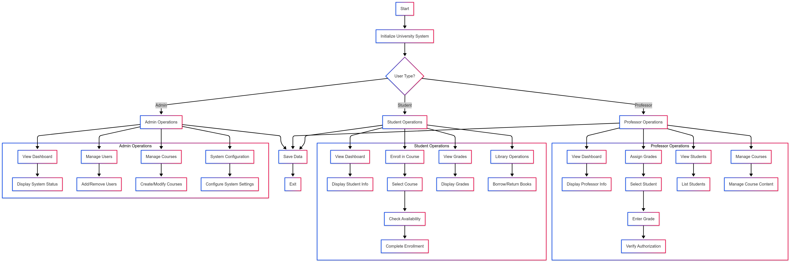
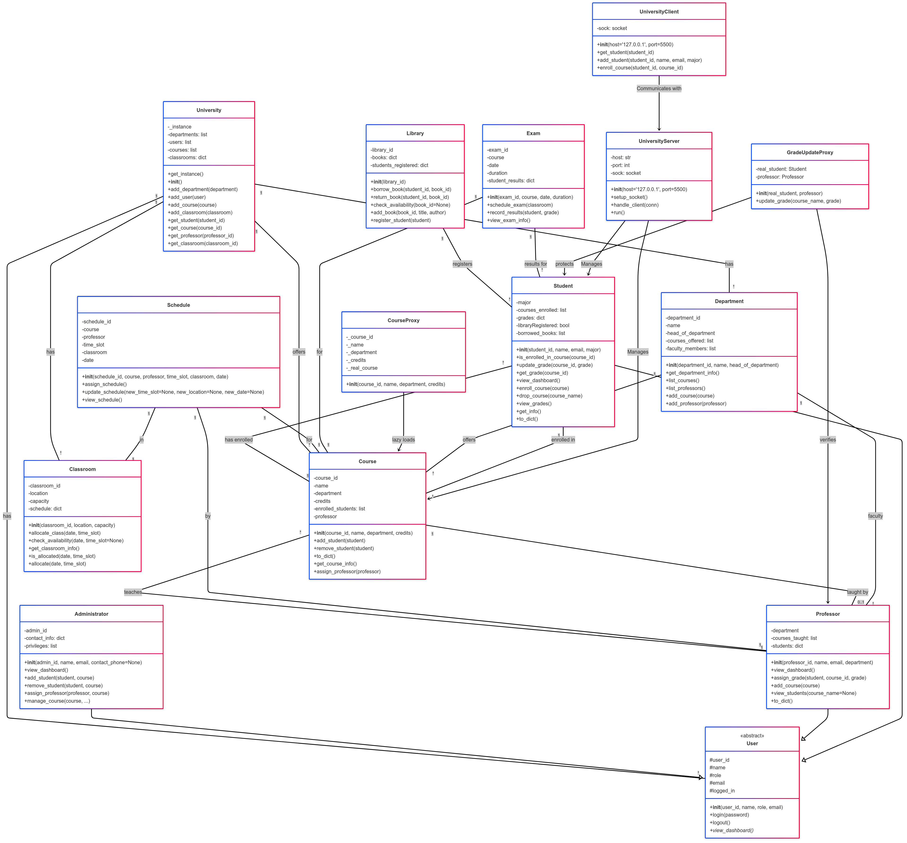

# 🎓 University Management System

A Python-based **University Management System** that allows **Administrators**, **Professors**, and **Students** to interact with courses, grades, library services, and system configuration.  

This project demonstrates **Object-Oriented Programming (OOP)** principles and includes detailed **Flowchart** and **UML Class Diagram** for better understanding and documentation.

---

## 📝 Features

### 🔑 Admin Operations
- View system dashboard  
- Manage users (add/remove)  
- Manage courses (create/modify)  
- Configure system settings  

### 👩‍🎓 Student Operations
- View dashboard (student info)  
- Enroll in courses (check availability & complete enrollment)  
- View grades  
- Library operations (borrow/return books)  

### 👨‍🏫 Professor Operations
- View dashboard (professor info)  
- Assign grades (with verification)  
- View students in courses  
- Manage course content  

---

#### System Flowchart  


#### UML Class Diagram  


---

## 🚀 Installation & Usage

1. **Clone the repository**
   ```bash
   git clone https://github.com/Maria-Medhat/university-system.git
   cd university-system
